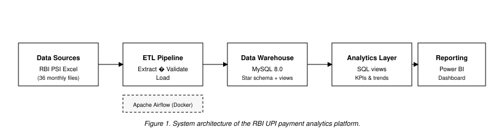
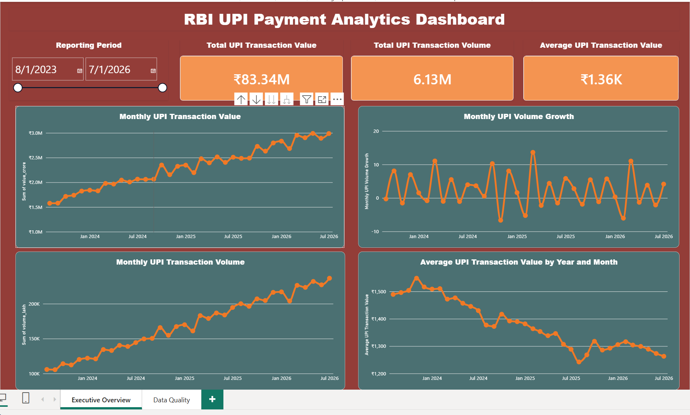

# RBI UPI Payment Analytics Platform

An end-to-end data engineering and Power BI project using monthly UPI data from the Reserve Bank of India.

## Architecture



*Figure 1.* System architecture of the RBI UPI payment analytics platform. Monthly RBI PSI Excel files are extracted and validated by a Python ETL pipeline orchestrated with Apache Airflow (Docker), loaded into a MySQL star-schema warehouse, enriched via SQL views, and consumed in Power BI.

## Project Highlights

* Processed 36 monthly RBI files
* Covered August 2023 to July 2026
* Extracted UPI transaction volume and value
* Built a dimensional MySQL warehouse
* Automated the pipeline using Apache Airflow
* Added data-quality checks and Pytest tests
* Created SQL views for analytical reporting
* Built an interactive Power BI dashboard

## Technology Stack

* Python, Pandas, OpenPyXL
* Apache Airflow
* Docker and Docker Compose
* MySQL
* SQLAlchemy and PyMySQL
* Pytest
* Power BI Desktop

## Pipeline Tasks

```text
extract_upi → validate_data → load_mysql
```

The pipeline calculates:

* Monthly transaction volume
* Monthly transaction value
* Average transaction value
* Month-over-month growth

## Key Findings

Analysis period: **August 2023 – July 2026** (36 monthly RBI PSI reports). Dashboard: [`figures/Dashboard.png`](figures/Dashboard.png).



1. **Sustained growth in scale** — Monthly UPI transaction **volume** and **value** both trend upward over the full period, consistent with continued adoption of UPI as a primary payment rail in India.

2. **Volume-led expansion** — Total activity rises even as **average transaction value** drifts down (roughly ₹1,500 toward ~₹1,260). Growth is driven by **more payments**, not larger payments per transaction.

3. **Shift toward smaller tickets** — Falling average ticket size alongside rising volume suggests broader use for **high-frequency, low-value** payments (e.g. retail, QR, everyday P2P), not only occasional large transfers.

4. **Volatile month-over-month volume growth** — MoM volume growth oscillates (often between about -7% and +14%), with occasional negative months. Long-run **level trends** are more stable indicators of structural growth than any single month’s growth rate.


## How to Run

Start the services:

```powershell
docker compose up -d
```

Open Airflow:

```text
http://localhost:8080
```

Trigger the `rbi_upi_pipeline` DAG.

Run tests:

```powershell
pytest
```

Power BI connects to:

```text
Server: 127.0.0.1:3307
Database: rbi_warehouse
```

## Data Source

| Field | Detail |
|-------|--------|
| **Provider** | [Reserve Bank of India (RBI)](https://www.rbi.org.in/) |
| **Publication** | Payment System Indicators (PSI) |
| **Metrics used** | UPI transaction volume (lakh) and value (₹ crore), excluding UPI QR where filtered in ETL |
| **Local files** | `data/raw/rbi_psi_YYYY_MM.xlsx` (36 monthly workbooks) |
| **Coverage** | August 2023 – July 2026 |

Public downloads: [RBI — Payment System Indicators](https://www.rbi.org.in/Scripts/AnnualPublications.aspx?head=Payment%20System%20Indicators) · [Database on Indian Economy (DBIE)](https://dbie.rbi.org.in/)

Raw RBI files are not committed to this repository; add them under `data/raw/` before running the pipeline.

## Acknowledgment

Payment statistics are sourced from the Reserve Bank of India. This repository is an independent portfolio and learning project and is **not** affiliated with, sponsored by, or endorsed by the RBI. 

## Project Outcome

This project demonstrates practical skills in Python ETL, Airflow orchestration, Docker, MySQL warehousing, SQL analytics, data validation, and Power BI reporting.
